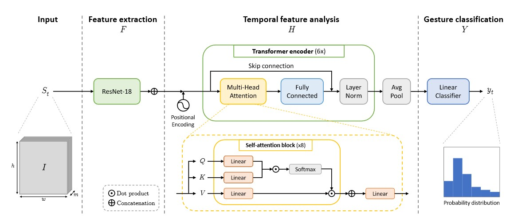

# Work In Progress - Thanos Project
Real-time hand gesture recognition deployed with TensorRT.

[Project management](https://www.notion.so/tonynguyen/Thanos-Project-fca58bc5858a458b88f05487f23a7515)


# Setup

All commands are ran from Thanos-Project root

```
pip install -r requirements.txt
```
- Add this directory in your PYTHONPATH


# IPN Hand Dataset
- Download [IPN Hand dataset](https://gibranbenitez.github.io/IPN_Hand/)
- Create `dataset_config.json` in the `Thanos-Project` directory with key-value:
    - "ipn": "path/to/ipn/root"
- Download annotation `ipnall.json` from [official repository](https://github.com/GibranBenitez/IPN-hand/blob/master/annotation_ipnGesture/ipnall.json), put it in `path_to_ipn_root/annotations/` 

# Model architecture



[A Transformer-Based Network for Dynamic Hand Gesture Recognition](https://iris.unimore.it/retrieve/handle/11380/1212263/282584/3DV_2020.pdf)

# Training
```
python thanos\trainers\train_on_ipn.py CONFIG_PATH
```
Example
```
python thanos\trainers\train_on_ipn.py thanos\trainers\expe\default_config.py
```

# First prototype

Configuration: `thanos\trainers\expe\default_config.py`

## Model configuration
- Input image size: 240x240
- Sequence length: 22 frames
- Temporal stride: 2
- Backbone: Resnet18


## Training result
- Batch size: 4
- Accumulated gradient batch: 4
- Learning rate: 1e-4
- Number of epochs: 20
- Validation accuracy: 0.75

## Inference with Jetson Nano


- Model predicts well some gesture.
- Model can distint non-gesture movement vs hand gesture (for example: drinking water).
- There are some early-detections which lead to a reduce in accuracy.

# Second prototype
- Improve accuracy for isolated gesture
- Add hand segmentation
- Avoid early-detection
- Improve latency in inference by preprocessing image on GPU